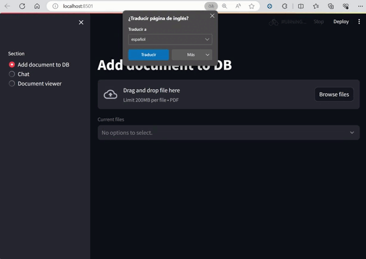
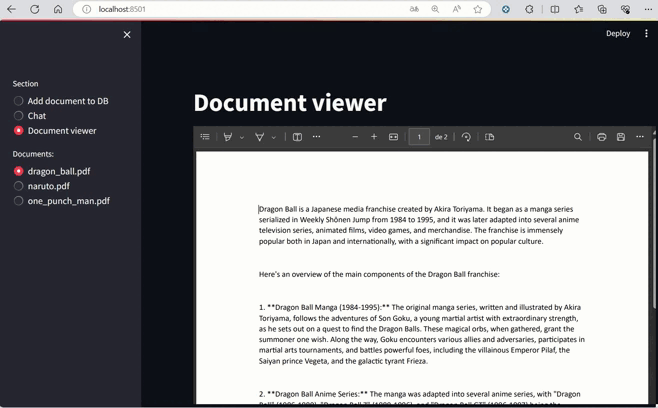

# QA ChatBot over documents

In this project, users have the capability to augment the vector database with new documents, which in turn fuels the generation of contextual information. This contextual information serves as the backbone for the Question-Answering (QA) ChatBot. Utilizing this context, the ChatBot adeptly responds to inquiries pertaining to the stored documents. It's important to note that the Language Model (LM) employed here exclusively relies on the provided context for its responses. The implementation seamlessly integrates Langchain, OpenAI, and Streamlit libraries, streamlining the functionality of the system.

## Table of Contents

1. [Installation](#installation)
2. [Usage](#usage)
3. [Contributing](#contributing)
4. [Project Structure](#project-structure)
5. [License](#license)
6. [Contact](#contact)

## Installation

<!--
To get started with the Awesome Python Project, follow these steps:

1. Clone the repository:

    ```bash
    git clone https://github.com/yourusername/awesome-python-project.git
    ```

2. Navigate to the project directory:

    ```bash
    cd awesome-python-project
    ```

3. Install the required dependencies:

    ```bash
    pip install -r requirements.txt
    ```
-->

## Usage
### Add document to Vector database
Here, upload, and read pdf content, then we divide the content into small text called chunks, next we get an embedding for each chunk, and finally we store the text and embedding together in the Vector database.  


### Chat
The chatbot can answer questions based on the pdf selected


### Document viewer
Here, we show the pdf content


<!--
```python
# Example code using Awesome Python Project
from awesome_project import helper_function

# Call the helper function
result = helper_function("Hello, Awesome World!")
print(result)
-->


## License
This project is licensed under the MIT License. See the LICENSE.md file for details.

# Contact
If you have any questions or suggestions, feel free to contact me:

Email: oscar.ismael.frausto.perez@gmail.com